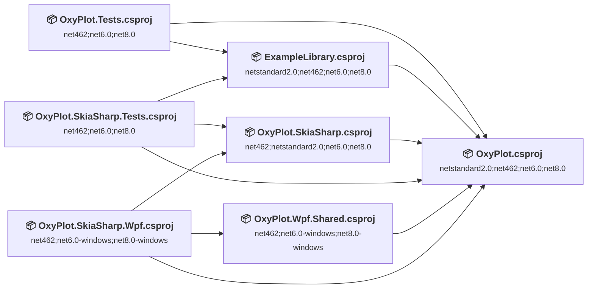
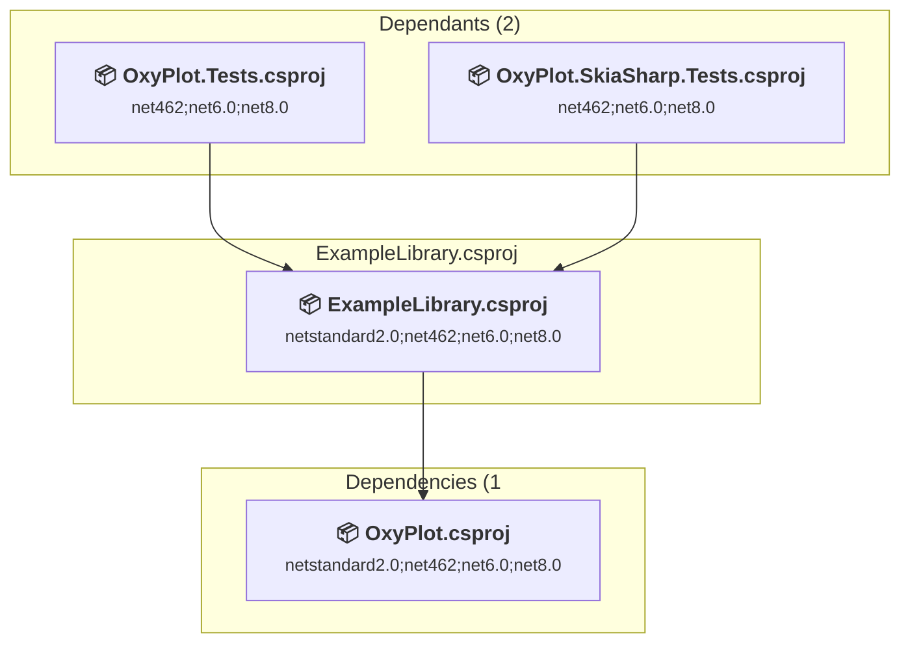
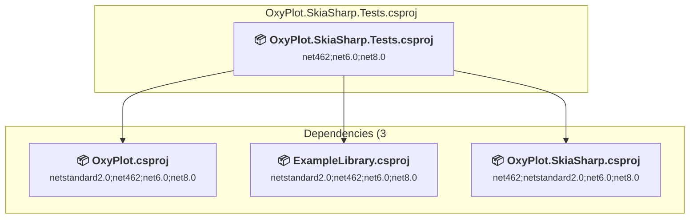
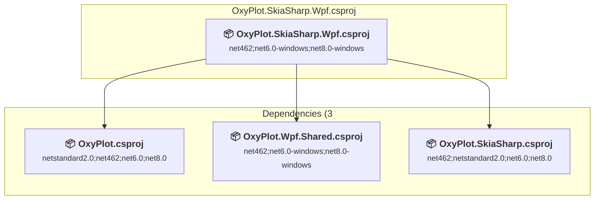
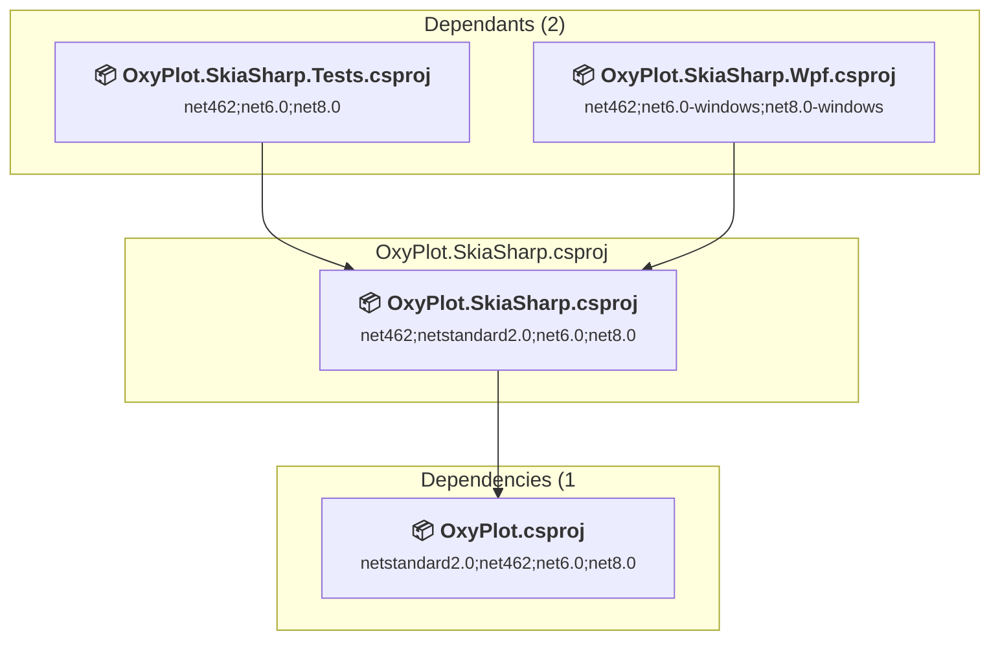
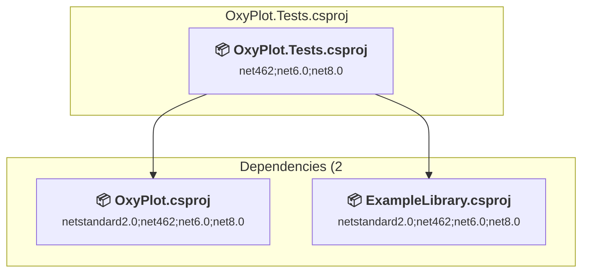
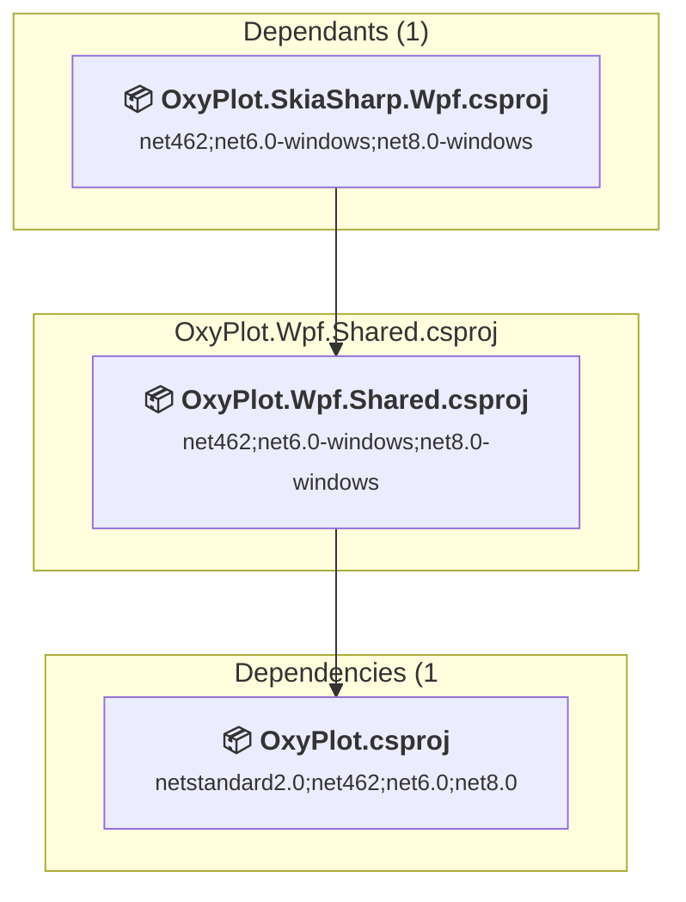
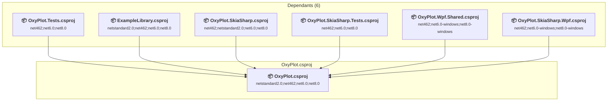

# Projects and dependencies analysis

This document provides a comprehensive overview of the projects and their dependencies in the context of upgrading to .NETCoreApp,Version=v10.0.

## Table of Contents

- [Executive Summary](#executive-Summary)
  - [Highlevel Metrics](#highlevel-metrics)
  - [Projects Compatibility](#projects-compatibility)
  - [Package Compatibility](#package-compatibility)
  - [API Compatibility](#api-compatibility)
- [Aggregate NuGet packages details](#aggregate-nuget-packages-details)
- [Top API Migration Challenges](#top-api-migration-challenges)
  - [Technologies and Features](#technologies-and-features)
  - [Most Frequent API Issues](#most-frequent-api-issues)
- [Projects Relationship Graph](#projects-relationship-graph)
- [Project Details](#project-details)

  - [Examples\ExampleLibrary\ExampleLibrary.csproj](#examplesexamplelibraryexamplelibrarycsproj)
  - [OxyPlot.SkiaSharp.Tests\OxyPlot.SkiaSharp.Tests.csproj](#oxyplotskiasharptestsoxyplotskiasharptestscsproj)
  - [OxyPlot.SkiaSharp.Wpf\OxyPlot.SkiaSharp.Wpf.csproj](#oxyplotskiasharpwpfoxyplotskiasharpwpfcsproj)
  - [OxyPlot.SkiaSharp\OxyPlot.SkiaSharp.csproj](#oxyplotskiasharpoxyplotskiasharpcsproj)
  - [OxyPlot.Tests\OxyPlot.Tests.csproj](#oxyplottestsoxyplottestscsproj)
  - [OxyPlot.Wpf.Shared\OxyPlot.Wpf.Shared.csproj](#oxyplotwpfsharedoxyplotwpfsharedcsproj)
  - [OxyPlot\OxyPlot.csproj](#oxyplotoxyplotcsproj)

## Executive Summary

### Highlevel Metrics

| Metric | Count | Status |
| :--- | :---: | :--- |
| Total Projects | 7 | All require upgrade |
| Total NuGet Packages | 11 | All compatible |
| Total Code Files | 441 |  |
| Total Code Files with Incidents | 26 |  |
| Total Lines of Code | 88828 |  |
| Total Number of Issues | 1411 |  |
| Estimated LOC to modify | 1402+ | at least 1.6% of codebase |

### Projects Compatibility

| Project | Target Framework | Difficulty | Package Issues | API Issues | Est. LOC Impact | Description |
| :--- | :---: | :---: | :---: | :---: | :---: | :--- |
| [Examples\ExampleLibrary\ExampleLibrary.csproj](#examplesexamplelibraryexamplelibrarycsproj) | netstandard2.0;net462;net6.0;net8.0 | 🟢 Low | 2 | 13 | 13+ | ClassLibrary, Sdk Style = True |
| [OxyPlot.SkiaSharp.Tests\OxyPlot.SkiaSharp.Tests.csproj](#oxyplotskiasharptestsoxyplotskiasharptestscsproj) | net462;net6.0;net8.0 | 🟢 Low | 0 | 0 |  | ClassLibrary, Sdk Style = True |
| [OxyPlot.SkiaSharp.Wpf\OxyPlot.SkiaSharp.Wpf.csproj](#oxyplotskiasharpwpfoxyplotskiasharpwpfcsproj) | net462;net6.0-windows;net8.0-windows | 🟡 Medium | 0 | 119 | 119+ | Wpf, Sdk Style = True |
| [OxyPlot.SkiaSharp\OxyPlot.SkiaSharp.csproj](#oxyplotskiasharpoxyplotskiasharpcsproj) | net462;netstandard2.0;net6.0;net8.0 | 🟢 Low | 0 | 0 |  | ClassLibrary, Sdk Style = True |
| [OxyPlot.Tests\OxyPlot.Tests.csproj](#oxyplottestsoxyplottestscsproj) | net462;net6.0;net8.0 | 🟢 Low | 0 | 0 |  | ClassLibrary, Sdk Style = True |
| [OxyPlot.Wpf.Shared\OxyPlot.Wpf.Shared.csproj](#oxyplotwpfsharedoxyplotwpfsharedcsproj) | net462;net6.0-windows;net8.0-windows | 🟡 Medium | 0 | 1268 | 1268+ | Wpf, Sdk Style = True |
| [OxyPlot\OxyPlot.csproj](#oxyplotoxyplotcsproj) | netstandard2.0;net462;net6.0;net8.0 | 🟢 Low | 0 | 2 | 2+ | ClassLibrary, Sdk Style = True |

### Package Compatibility

| Status | Count | Percentage |
| :--- | :---: | :---: |
| ✅ Compatible | 11 | 100.0% |
| ⚠️ Incompatible | 0 | 0.0% |
| 🔄 Upgrade Recommended | 0 | 0.0% |
| ***Total NuGet Packages*** | ***11*** | ***100%*** |

### API Compatibility

| Category | Count | Impact |
| :--- | :---: | :--- |
| 🔴 Binary Incompatible | 1387 | High - Require code changes |
| 🟡 Source Incompatible | 15 | Medium - Needs re-compilation and potential conflicting API error fixing |
| 🔵 Behavioral change | 0 | Low - Behavioral changes that may require testing at runtime |
| ✅ Compatible | 51325 |  |
| ***Total APIs Analyzed*** | ***52727*** |  |

## Aggregate NuGet packages details

| Package | Current Version | Suggested Version | Projects | Description |
| :--- | :---: | :---: | :--- | :--- |
| DotNet.ReproducibleBuilds | 1.1.1 |  | [ExampleLibrary.csproj](#examplesexamplelibraryexamplelibrarycsproj) [OxyPlot.csproj](#oxyplotoxyplotcsproj) [OxyPlot.SkiaSharp.csproj](#oxyplotskiasharpoxyplotskiasharpcsproj) [OxyPlot.SkiaSharp.Tests.csproj](#oxyplotskiasharptestsoxyplotskiasharptestscsproj) [OxyPlot.SkiaSharp.Wpf.csproj](#oxyplotskiasharpwpfoxyplotskiasharpwpfcsproj) [OxyPlot.Tests.csproj](#oxyplottestsoxyplottestscsproj) [OxyPlot.Wpf.Shared.csproj](#oxyplotwpfsharedoxyplotwpfsharedcsproj) | ✅Compatible |
| Microsoft.NET.Test.Sdk | 16.6.0 |  | [OxyPlot.SkiaSharp.Tests.csproj](#oxyplotskiasharptestsoxyplotskiasharptestscsproj) [OxyPlot.Tests.csproj](#oxyplottestsoxyplottestscsproj) | ✅Compatible |
| NETStandard.Library | 2.0.3 |  | [ExampleLibrary.csproj](#examplesexamplelibraryexamplelibrarycsproj) [OxyPlot.csproj](#oxyplotoxyplotcsproj) | ✅Compatible |
| NSubstitute | 4.2.1 |  | [OxyPlot.Tests.csproj](#oxyplottestsoxyplottestscsproj) | ✅Compatible |
| NUnit | 3.14.0 |  | [OxyPlot.SkiaSharp.Tests.csproj](#oxyplotskiasharptestsoxyplotskiasharptestscsproj) [OxyPlot.Tests.csproj](#oxyplottestsoxyplottestscsproj) | ✅Compatible |
| NUnit3TestAdapter | 4.5.0 |  | [OxyPlot.SkiaSharp.Tests.csproj](#oxyplotskiasharptestsoxyplotskiasharptestscsproj) [OxyPlot.Tests.csproj](#oxyplottestsoxyplottestscsproj) | ✅Compatible |
| SkiaSharp | 2.88.8 |  | [OxyPlot.SkiaSharp.csproj](#oxyplotskiasharpoxyplotskiasharpcsproj) | ✅Compatible |
| SkiaSharp.HarfBuzz | 2.88.8 |  | [OxyPlot.SkiaSharp.csproj](#oxyplotskiasharpoxyplotskiasharpcsproj) | ✅Compatible |
| SkiaSharp.Views.Desktop.Common | 2.88.8 |  | [OxyPlot.SkiaSharp.Wpf.csproj](#oxyplotskiasharpwpfoxyplotskiasharpwpfcsproj) | ✅Compatible |
| System.Net.Requests | 4.3.0 |  | [ExampleLibrary.csproj](#examplesexamplelibraryexamplelibrarycsproj) | NuGet package functionality is included with framework reference |
| System.Xml.XmlSerializer | 4.3.0 |  | [ExampleLibrary.csproj](#examplesexamplelibraryexamplelibrarycsproj) | NuGet package functionality is included with framework reference |

## Top API Migration Challenges

### Technologies and Features

| Technology | Issues | Percentage | Migration Path |
| :--- | :---: | :---: | :--- |
| WPF (Windows Presentation Foundation) | 703 | 50.1% | WPF APIs for building Windows desktop applications with XAML-based UI that are available in .NET on Windows. WPF provides rich desktop UI capabilities with data binding and styling. Enable Windows Desktop support: Option 1 (Recommended): Target net9.0-windows; Option 2: Add <UseWindowsDesktop>true</UseWindowsDesktop>. |

### Most Frequent API Issues

| API | Count | Percentage | Category |
| :--- | :---: | :---: | :--- |
| T:System.Windows.Input.Key | 174 | 12.4% | Binary Incompatible |
| T:System.Windows.DependencyProperty | 78 | 5.6% | Binary Incompatible |
| T:System.Windows.Point | 66 | 4.7% | Binary Incompatible |
| T:System.Windows.VerticalAlignment | 53 | 3.8% | Binary Incompatible |
| M:System.Windows.Point.#ctor(System.Double,System.Double) | 52 | 3.7% | Binary Incompatible |
| T:System.Windows.HorizontalAlignment | 45 | 3.2% | Binary Incompatible |
| T:System.Windows.FrameworkElement | 25 | 1.8% | Binary Incompatible |
| M:System.Windows.DependencyObject.SetValue(System.Windows.DependencyProperty,System.Object) | 24 | 1.7% | Binary Incompatible |
| M:System.Windows.DependencyObject.GetValue(System.Windows.DependencyProperty) | 24 | 1.7% | Binary Incompatible |
| T:System.Windows.Visibility | 21 | 1.5% | Binary Incompatible |
| P:System.Windows.RoutedEventArgs.Handled | 20 | 1.4% | Binary Incompatible |
| T:System.Windows.Thickness | 18 | 1.3% | Binary Incompatible |
| T:System.Windows.Shapes.Line | 18 | 1.3% | Binary Incompatible |
| T:System.Windows.Controls.ControlTemplate | 18 | 1.3% | Binary Incompatible |
| T:System.Windows.Input.Cursor | 18 | 1.3% | Binary Incompatible |
| T:System.Windows.DependencyObject | 17 | 1.2% | Binary Incompatible |
| T:System.Windows.Media.Imaging.WriteableBitmap | 17 | 1.2% | Binary Incompatible |
| T:System.Windows.Controls.Grid | 16 | 1.1% | Binary Incompatible |
| T:System.Windows.Input.MouseButton | 15 | 1.1% | Binary Incompatible |
| T:System.Windows.Controls.ContentControl | 14 | 1.0% | Binary Incompatible |
| T:System.Windows.Media.Color | 13 | 0.9% | Binary Incompatible |
| F:System.Windows.VerticalAlignment.Top | 11 | 0.8% | Binary Incompatible |
| T:System.Windows.Controls.Canvas | 11 | 0.8% | Binary Incompatible |
| M:System.Windows.Thickness.#ctor(System.Double,System.Double,System.Double,System.Double) | 10 | 0.7% | Binary Incompatible |
| T:System.Windows.Controls.ContentPresenter | 10 | 0.7% | Binary Incompatible |
| T:System.Windows.Media.VisualTreeHelper | 8 | 0.6% | Binary Incompatible |
| T:System.Windows.Media.Matrix | 8 | 0.6% | Binary Incompatible |
| F:System.Windows.VerticalAlignment.Bottom | 8 | 0.6% | Binary Incompatible |
| F:System.Windows.HorizontalAlignment.Left | 8 | 0.6% | Binary Incompatible |
| T:System.Windows.Input.Keyboard | 8 | 0.6% | Binary Incompatible |
| M:System.Windows.Input.Keyboard.IsKeyDown(System.Windows.Input.Key) | 8 | 0.6% | Binary Incompatible |
| M:System.TimeSpan.FromHours(System.Double) | 7 | 0.5% | Source Incompatible |
| T:System.Windows.Media.Brush | 7 | 0.5% | Binary Incompatible |
| F:System.Windows.HorizontalAlignment.Right | 7 | 0.5% | Binary Incompatible |
| T:System.Windows.Size | 7 | 0.5% | Binary Incompatible |
| T:System.Windows.Controls.ContextMenu | 7 | 0.5% | Binary Incompatible |
| P:System.Windows.FrameworkElement.ContextMenu | 7 | 0.5% | Binary Incompatible |
| M:System.Windows.Media.VisualTreeHelper.GetParent(System.Windows.DependencyObject) | 6 | 0.4% | Binary Incompatible |
| F:System.Windows.VerticalAlignment.Center | 6 | 0.4% | Binary Incompatible |
| F:System.Windows.HorizontalAlignment.Center | 6 | 0.4% | Binary Incompatible |
| M:System.Windows.FrameworkElement.GetTemplateChild(System.String) | 6 | 0.4% | Binary Incompatible |
| T:System.Windows.FrameworkPropertyMetadata | 6 | 0.4% | Binary Incompatible |
| M:System.Windows.FrameworkPropertyMetadata.#ctor(System.Object) | 6 | 0.4% | Binary Incompatible |
| M:System.Windows.DependencyProperty.OverrideMetadata(System.Type,System.Windows.PropertyMetadata) | 6 | 0.4% | Binary Incompatible |
| T:System.Windows.Controls.UIElementCollection | 6 | 0.4% | Binary Incompatible |
| P:System.Windows.Controls.Panel.Children | 6 | 0.4% | Binary Incompatible |
| T:System.Windows.Vector | 6 | 0.4% | Binary Incompatible |
| M:System.Windows.Input.MouseEventArgs.GetPosition(System.Windows.IInputElement) | 6 | 0.4% | Binary Incompatible |
| M:System.TimeSpan.FromSeconds(System.Double) | 5 | 0.4% | Source Incompatible |
| P:System.Windows.UIElement.Visibility | 5 | 0.4% | Binary Incompatible |

## Projects Relationship Graph

Legend:
📦 SDK-style project
⚙️ Classic project

## Project Details

### Examples\ExampleLibrary\ExampleLibrary.csproj

#### Project Info

- **Current Target Framework:** netstandard2.0;net462;net6.0;net8.0
- **Proposed Target Framework:** netstandard2.0;net462;net6.0;net8.0;net10.0
- **SDK-style**: True
- **Project Kind:** ClassLibrary
- **Dependencies**: 1
- **Dependants**: 2
- **Number of Files**: 97
- **Number of Files with Incidents**: 6
- **Lines of Code**: 25124
- **Estimated LOC to modify**: 13+ (at least 0.1% of the project)

#### Dependency Graph

Legend:
📦 SDK-style project
⚙️ Classic project

### API Compatibility

| Category | Count | Impact |
| :--- | :---: | :--- |
| 🔴 Binary Incompatible | 0 | High - Require code changes |
| 🟡 Source Incompatible | 13 | Medium - Needs re-compilation and potential conflicting API error fixing |
| 🔵 Behavioral change | 0 | Low - Behavioral changes that may require testing at runtime |
| ✅ Compatible | 19193 |  |
| ***Total APIs Analyzed*** | ***19206*** |  |

### OxyPlot.SkiaSharp.Tests\OxyPlot.SkiaSharp.Tests.csproj

#### Project Info

- **Current Target Framework:** net462;net6.0;net8.0
- **Proposed Target Framework:** net462;net6.0;net8.0;net10.0
- **SDK-style**: True
- **Project Kind:** ClassLibrary
- **Dependencies**: 3
- **Dependants**: 0
- **Number of Files**: 22
- **Number of Files with Incidents**: 1
- **Lines of Code**: 742
- **Estimated LOC to modify**: 0+ (at least 0.0% of the project)

#### Dependency Graph

Legend:
📦 SDK-style project
⚙️ Classic project

### API Compatibility

| Category | Count | Impact |
| :--- | :---: | :--- |
| 🔴 Binary Incompatible | 0 | High - Require code changes |
| 🟡 Source Incompatible | 0 | Medium - Needs re-compilation and potential conflicting API error fixing |
| 🔵 Behavioral change | 0 | Low - Behavioral changes that may require testing at runtime |
| ✅ Compatible | 716 |  |
| ***Total APIs Analyzed*** | ***716*** |  |

### OxyPlot.SkiaSharp.Wpf\OxyPlot.SkiaSharp.Wpf.csproj

#### Project Info

- **Current Target Framework:** net462;net6.0-windows;net8.0-windows
- **Proposed Target Framework:** net462;net6.0-windows;net8.0-windows;net10.0-windows
- **SDK-style**: True
- **Project Kind:** Wpf
- **Dependencies**: 3
- **Dependants**: 0
- **Number of Files**: 17
- **Number of Files with Incidents**: 3
- **Lines of Code**: 349
- **Estimated LOC to modify**: 119+ (at least 34.1% of the project)

#### Dependency Graph

Legend:
📦 SDK-style project
⚙️ Classic project

### API Compatibility

| Category | Count | Impact |
| :--- | :---: | :--- |
| 🔴 Binary Incompatible | 119 | High - Require code changes |
| 🟡 Source Incompatible | 0 | Medium - Needs re-compilation and potential conflicting API error fixing |
| 🔵 Behavioral change | 0 | Low - Behavioral changes that may require testing at runtime |
| ✅ Compatible | 144 |  |
| ***Total APIs Analyzed*** | ***263*** |  |

#### Project Technologies and Features

| Technology | Issues | Percentage | Migration Path |
| :--- | :---: | :---: | :--- |
| WPF (Windows Presentation Foundation) | 77 | 64.7% | WPF APIs for building Windows desktop applications with XAML-based UI that are available in .NET on Windows. WPF provides rich desktop UI capabilities with data binding and styling. Enable Windows Desktop support: Option 1 (Recommended): Target net9.0-windows; Option 2: Add <UseWindowsDesktop>true</UseWindowsDesktop>. |

### OxyPlot.SkiaSharp\OxyPlot.SkiaSharp.csproj

#### Project Info

- **Current Target Framework:** net462;netstandard2.0;net6.0;net8.0
- **Proposed Target Framework:** net462;netstandard2.0;net6.0;net8.0;net10.0
- **SDK-style**: True
- **Project Kind:** ClassLibrary
- **Dependencies**: 1
- **Dependants**: 2
- **Number of Files**: 21
- **Number of Files with Incidents**: 1
- **Lines of Code**: 1376
- **Estimated LOC to modify**: 0+ (at least 0.0% of the project)

#### Dependency Graph

Legend:
📦 SDK-style project
⚙️ Classic project

### API Compatibility

| Category | Count | Impact |
| :--- | :---: | :--- |
| 🔴 Binary Incompatible | 0 | High - Require code changes |
| 🟡 Source Incompatible | 0 | Medium - Needs re-compilation and potential conflicting API error fixing |
| 🔵 Behavioral change | 0 | Low - Behavioral changes that may require testing at runtime |
| ✅ Compatible | 917 |  |
| ***Total APIs Analyzed*** | ***917*** |  |

### OxyPlot.Tests\OxyPlot.Tests.csproj

#### Project Info

- **Current Target Framework:** net462;net6.0;net8.0
- **Proposed Target Framework:** net462;net6.0;net8.0;net10.0
- **SDK-style**: True
- **Project Kind:** ClassLibrary
- **Dependencies**: 2
- **Dependants**: 0
- **Number of Files**: 56
- **Number of Files with Incidents**: 1
- **Lines of Code**: 5700
- **Estimated LOC to modify**: 0+ (at least 0.0% of the project)

#### Dependency Graph

Legend:
📦 SDK-style project
⚙️ Classic project

### API Compatibility

| Category | Count | Impact |
| :--- | :---: | :--- |
| 🔴 Binary Incompatible | 0 | High - Require code changes |
| 🟡 Source Incompatible | 0 | Medium - Needs re-compilation and potential conflicting API error fixing |
| 🔵 Behavioral change | 0 | Low - Behavioral changes that may require testing at runtime |
| ✅ Compatible | 5002 |  |
| ***Total APIs Analyzed*** | ***5002*** |  |

### OxyPlot.Wpf.Shared\OxyPlot.Wpf.Shared.csproj

#### Project Info

- **Current Target Framework:** net462;net6.0-windows;net8.0-windows
- **Proposed Target Framework:** net462;net6.0-windows;net8.0-windows;net10.0-windows
- **SDK-style**: True
- **Project Kind:** Wpf
- **Dependencies**: 1
- **Dependants**: 1
- **Number of Files**: 13
- **Number of Files with Incidents**: 12
- **Lines of Code**: 2326
- **Estimated LOC to modify**: 1268+ (at least 54.5% of the project)

#### Dependency Graph

Legend:
📦 SDK-style project
⚙️ Classic project

### API Compatibility

| Category | Count | Impact |
| :--- | :---: | :--- |
| 🔴 Binary Incompatible | 1268 | High - Require code changes |
| 🟡 Source Incompatible | 0 | Medium - Needs re-compilation and potential conflicting API error fixing |
| 🔵 Behavioral change | 0 | Low - Behavioral changes that may require testing at runtime |
| ✅ Compatible | 543 |  |
| ***Total APIs Analyzed*** | ***1811*** |  |

#### Project Technologies and Features

| Technology | Issues | Percentage | Migration Path |
| :--- | :---: | :---: | :--- |
| WPF (Windows Presentation Foundation) | 626 | 49.4% | WPF APIs for building Windows desktop applications with XAML-based UI that are available in .NET on Windows. WPF provides rich desktop UI capabilities with data binding and styling. Enable Windows Desktop support: Option 1 (Recommended): Target net9.0-windows; Option 2: Add <UseWindowsDesktop>true</UseWindowsDesktop>. |

### OxyPlot\OxyPlot.csproj

#### Project Info

- **Current Target Framework:** netstandard2.0;net462;net6.0;net8.0
- **Proposed Target Framework:** netstandard2.0;net462;net6.0;net8.0;net10.0
- **SDK-style**: True
- **Project Kind:** ClassLibrary
- **Dependencies**: 0
- **Dependants**: 6
- **Number of Files**: 273
- **Number of Files with Incidents**: 2
- **Lines of Code**: 53211
- **Estimated LOC to modify**: 2+ (at least 0.0% of the project)

#### Dependency Graph

Legend:
📦 SDK-style project
⚙️ Classic project

### API Compatibility

| Category | Count | Impact |
| :--- | :---: | :--- |
| 🔴 Binary Incompatible | 0 | High - Require code changes |
| 🟡 Source Incompatible | 2 | Medium - Needs re-compilation and potential conflicting API error fixing |
| 🔵 Behavioral change | 0 | Low - Behavioral changes that may require testing at runtime |
| ✅ Compatible | 24810 |  |
| ***Total APIs Analyzed*** | ***24812*** |  |

